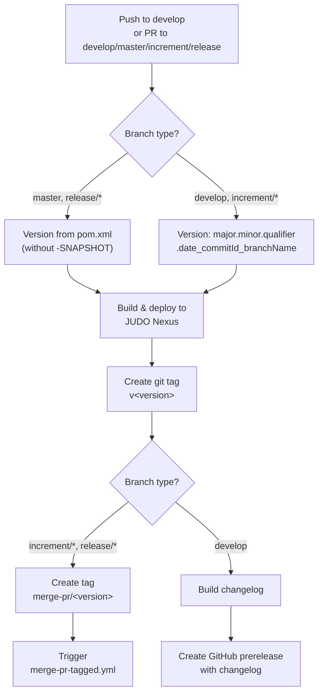
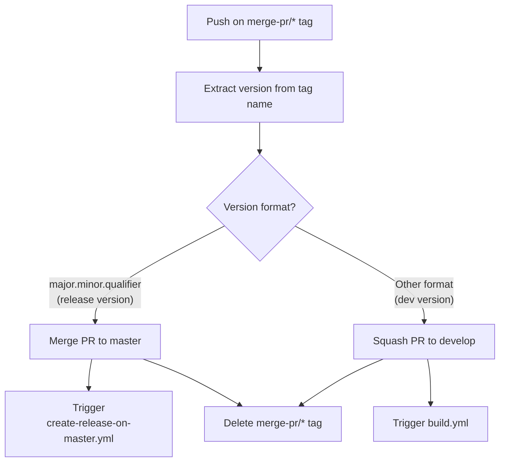
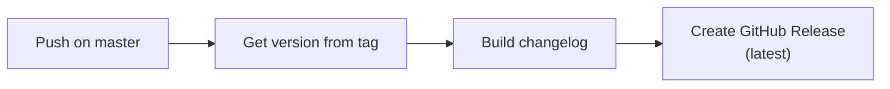
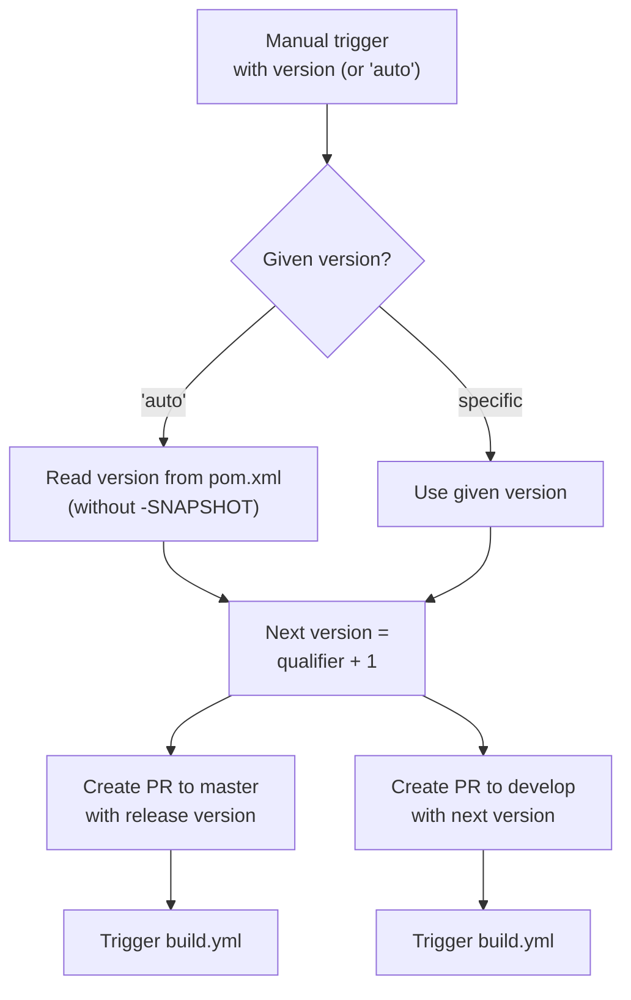

# CI/CD Flow — Development Version and Branch Handling

This document describes the GitFlow-based branching strategy and GitHub Actions CI/CD pipeline used by the OSGi I18N project (and other JUDO NG modules).

## Branches

The versioning policy is based on [GitFlow](https://www.atlassian.com/git/tutorials/comparing-workflows/gitflow-workflow).

```mermaid
gitGraph
    commit id: "initial"
    branch develop
    checkout develop
    commit id: "dev work"
    branch feature/JNG-1
    commit id: "feature 1"
    checkout develop
    merge feature/JNG-1 id: "merge feature"
    branch release/1.0-beta1
    commit id: "rc1"
    branch bugfix/JNG-4
    commit id: "fix bug"
    checkout release/1.0-beta1
    merge bugfix/JNG-4 id: "merge fix"
    checkout develop
    merge release/1.0-beta1 id: "merge release to dev"
    checkout master
    merge release/1.0-beta1 id: "release 1.0"
```

| Branch Pattern | Base | Purpose |
|---------------|------|---------|
| `develop` | — | Main development branch. Contains latest development sources of the active version. |
| `feature/JNG-NUMBER_summary` | `develop` | New features that will be included in the active version. |
| `release/X.Y-betaN` or `X_Y_betaN` | `develop` | Release candidates. The `release/` prefix is reserved for CI. |
| `bugfix/JNG-NUMBER_summary` | release branch | Fixes found during release testing. Must also be applied to newer release and develop branches. |
| `support/JNG-NUMBER_summary` | release branch | Minor changes for a previous release. Merged back to the release branch when the update ships. |
| `master` | — | Contains the latest released sources of the active version. |
| `hotfix/JNG-NUMBER_summary` | `master` | Emergency fixes applied to both release and master branches. |

## Version Numbers

Version numbers follow semantic versioning with these rules:

| Event | Version Change |
|-------|---------------|
| Start a feature branch | No change |
| Start a release branch from develop | Increment 2nd number on `develop` |
| Start a bugfix branch | No change (applied to release during testing) |
| Start a support branch | Increment 3rd number |
| Start a hotfix branch | Increment 3rd number |

## GitHub Actions Workflows

### build.yml — Main Build Pipeline

This is the primary CI workflow that builds, tests, deploys, and tags every push.



### merge-pr-tagged.yml — Pull Request Merge Handler

Triggered when a `merge-pr/*` tag is pushed. Decides whether to merge to `master` or squash to `develop` based on the version format.



### create-release-on-master.yml — Release Publisher

Triggered by pushes to `master`. Creates a GitHub Release with a generated changelog.



### release.yml — Release Initiator

Manually triggered workflow that creates release and version-bump pull requests.



## Development Rules

> **Important:** There is no commit without a ticket number. Every pull request and commit must include `JNG-xxx` in the message.

Issue tracking uses [JIRA](https://blackbelt.atlassian.net/jira/dashboards).
