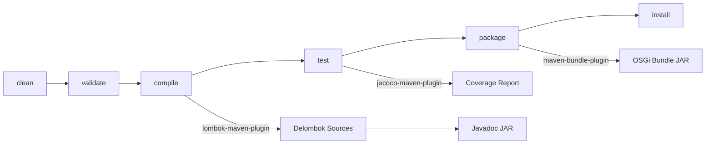

# Contributing to OSGi I18N

This guide covers everything you need to know to contribute to the OSGi I18N project, part of the JUDO ecosystem.

## Development Environment Setup

Make sure your development environment meets the requirements outlined in the parent project's [CONTRIBUTING guide](https://github.com/BlackBeltTechnology/judo-community/blob/develop/CONTRIBUTING.adoc).

**Required:**
- Java 21 JDK (source compatibility is Java 8)
- Maven 3.6+
- Git

## Project Structure

This is a standard Maven multi-module Java project:

```
osgi-i18n/
├── i18n-api/              # Public API interfaces and annotations (bundle)
├── i18n-resourcebundle/   # Properties-based implementation (bundle)
└── pom.xml                # Parent POM with shared config
```

## Build and Test

```bash
# Run all tests
mvn clean test

# Full build (compile, test, package, install locally)
mvn clean install

# Run a specific test
mvn test -pl i18n-resourcebundle -Dtest=I18nServiceImplTest
```

## Build Lifecycle



## Submitting an Issue

Before creating a new issue, search the [issue tracker](https://github.com/BlackBeltTechnology/osgi-i18n/issues) — your problem may already be reported or resolved.

To help us reproduce and fix bugs quickly, please include:
- Output of `java -version` and `mvn -version`
- Your `pom.xml` or `.flattened-pom.xml` (if relevant)
- A minimal reproduction case that demonstrates the failure

We require minimal reproductions to save maintainer time and fix more bugs. We understand extracting essentials from a larger codebase can be difficult, but isolating the problem is necessary before we can fix it.

File new issues using the [issue form](https://github.com/BlackBeltTechnology/osgi-i18n/issues/new/choose).

## Submitting a Pull Request

This project follows [GitHub's standard forking model](https://guides.github.com/activities/forking/). Fork the project and submit pull requests from your fork.

### Branch Naming

- `feature/JNG-NUMBER_short_summary` — new features (branch from `develop`)
- `bugfix/JNG-NUMBER_short_summary` — fixes on release branches
- `hotfix/JNG-NUMBER_short_summary` — production fixes (branch from `master`)
- `support/JNG-NUMBER_short_summary` — minor changes to previous releases

> **Important:** Every commit must reference a JIRA ticket number (`JNG-xxx`).
