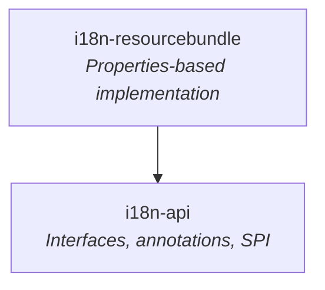
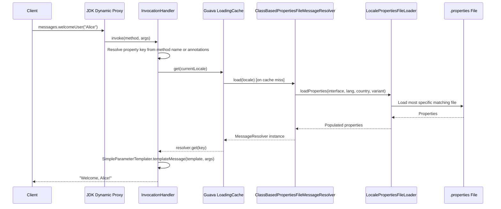
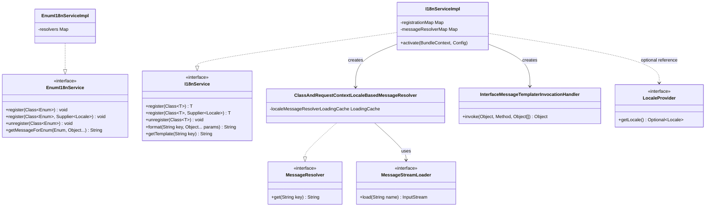
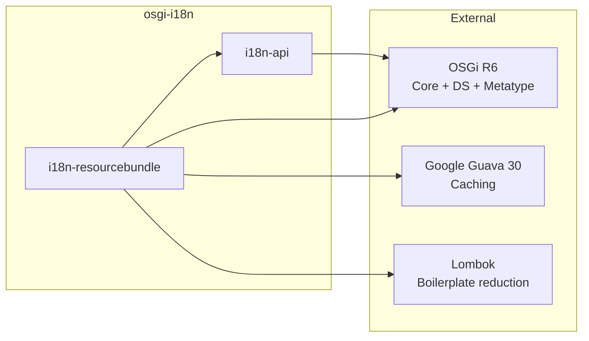

# OSGi I18N

An internationalization (i18n) library for OSGi-based Java applications. It provides locale-aware message resolution from `.properties` files, dynamic proxy-based interface implementations for type-safe message access, and enum message translation — all integrated with the OSGi service registry.

## How It Works

You define a Java interface whose methods correspond to message keys. The library creates a JDK dynamic proxy for that interface and registers it as an OSGi service. When you call a method on the proxy, it resolves the matching property key, loads the correct locale-specific `.properties` file, applies parameter substitution, and returns the localized string.

### Quick Example

1. Define a message interface:

```java
public interface AppMessages {
    String welcomeUser(String name);       // key: "welcomeUser"
    String itemCount(int count);           // key: "itemCount"
}
```

2. Create properties files:

```properties
# AppMessages.properties (default)
welcomeUser=Welcome, {0}!
itemCount=You have {0} items.

# AppMessages_hu.properties (Hungarian)
welcomeUser=Üdvözöljük, {0}!
itemCount={0} elemed van.
```

3. Register and use:

```java
@Reference
I18nService i18nService;

AppMessages messages = i18nService.register(AppMessages.class);
messages.welcomeUser("Alice");  // → "Welcome, Alice!" or "Üdvözöljük, Alice!"
```

## Module Structure



| Module | Artifact ID | Description |
|--------|-------------|-------------|
| `i18n-api/` | `i18n-api` | Public API: `I18nService`, `EnumI18nService`, `MessageResolver`, `MessageStreamLoader`, `LocaleProvider` interfaces and `@Message`, `@MessageByKey`, `@MessageByEnum` annotations |
| `i18n-resourcebundle/` | `i18n-impl` | Implementation using Java `.properties` files with Guava caching for locale-based resolver instances |

## Architecture

### Message Resolution Pipeline



### Locale Resolution

The locale used for message lookup is determined by this fallback chain:

1. Custom `Supplier<Locale>` passed to `register(clazz, localeSupplier)`
2. `LocaleProvider` OSGi service (optional `@Reference`)
3. Configured `defaultLocale` from OSGi Config Admin
4. `Locale.getDefault()` (JVM default)

### Property File Fallback

`LocalePropertiesFileLoader` looks for the most specific properties file first and falls back to less specific ones:

1. `Messages_en_US_variant.properties`
2. `Messages_en_US.properties`
3. `Messages_en.properties`
4. `Messages.properties`

The file path is derived from the interface's fully qualified name (dots replaced with slashes).

### Key Annotations

| Annotation | Target | Purpose |
|------------|--------|---------|
| `@MessageByKey` | Method | Method takes `(String key, Object[] params)` — looks up an arbitrary key at runtime |
| `@Message(value, key)` | Method | Provides an inline template (`value`) or overrides the property key (`key`) |
| `@MessageByEnum` | Method | Resolves messages for enum constants |

### Class Diagram



### Dependency Graph



## Build Commands

```bash
# Full build (compile + test + package)
./mvnw clean install

# Run all tests
./mvnw clean test

# Run a specific test class
./mvnw test -pl i18n-resourcebundle -Dtest=I18nServiceImplTest

# Run a specific test method
./mvnw test -pl i18n-resourcebundle -Dtest=I18nServiceImplTest#testChangeLanguage
```

## Technology Stack

| Technology | Version | Purpose |
|------------|---------|---------|
| Java | 1.8 (source) / 21 (runtime) | Language level |
| OSGi | R6 (6.0.0) | Service registry, bundle lifecycle |
| Guava | 30.0-jre | `LoadingCache` for locale-based resolver caching |
| Lombok | 1.18.34 | `@Slf4j`, boilerplate reduction |
| JUnit | 4.12 | Unit testing |
| Mockito | 3.0.0 | Mocking in tests |
| Maven Bundle Plugin | 5.1.2 | OSGi bundle packaging |

## License

[Apache License 2.0](LICENSE)
